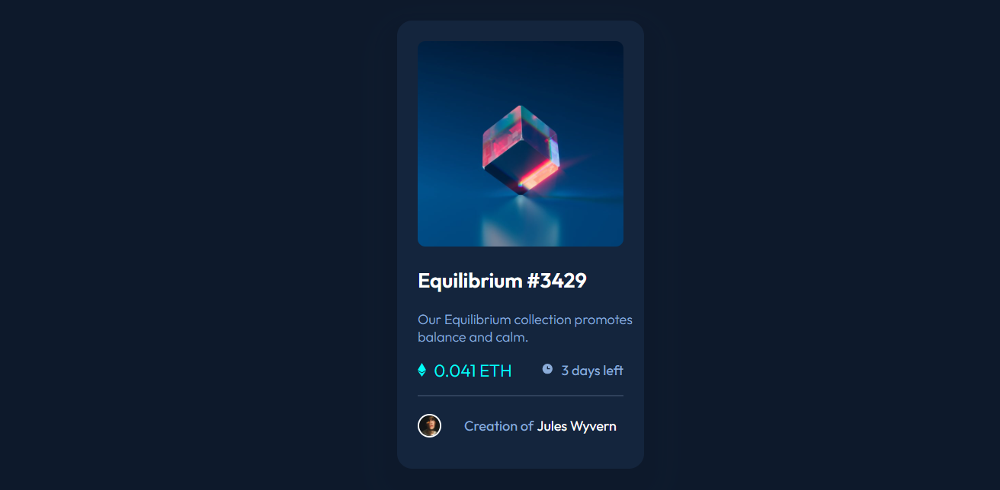
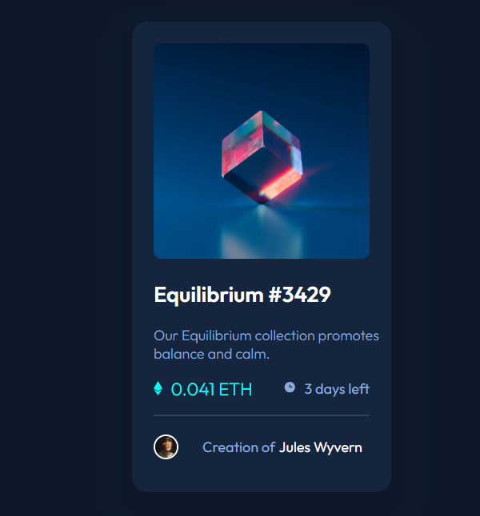

# Frontend Mentor - NFT preview card component solution

This is a solution to the [NFT preview card component challenge on Frontend Mentor](https://www.frontendmentor.io/challenges/nft-preview-card-component-SbdUL_w0U). Frontend Mentor challenges help you improve your coding skills by building realistic projects. 

## Table of contents

- [Overview](#overview)
  - [The challenge](#the-challenge)
  - [Screenshot](#screenshot)
  - [Links](#links)
- [My process](#my-process)
  - [Built with](#built-with)
  - [What I learned](#what-i-learned)
- [Author](#author)


## Overview

### The challenge

Users should be able to:

- View the optimal layout depending on their device's screen size
- See hover states for interactive elements

### Screenshot

- Desktop 
---


- Mobile
---


### Links

- Solution URL: [Github](https://github.com/Dhanveeryadav/NFT-Component)
- Live Site URL: [Live Site](https://flourishing-youtiao-03d220.netlify.app)

## My process

### Built with

- Semantic HTML5 markup
- CSS custom properties
- Flexbox
- Mobile-first workflow

### What I learned

During this challenge I learned about the css pseudo-elements **::before** and **::after** this help me a lot when I have to work on image hovering where it change color and a eye-icon will appear on hover.

### Some Things to remember before work on the before and after pseudo-elements.

- They will not work without **content**
- To see element on the screen set width and height

code snippets

```css
.card-link::after {
  content: "";
  position: absolute;
  width: 100%;
  height: 50%;
  background-image: url(images/icon-view.svg);
  background-repeat: no-repeat;
  opacity: 0;
  top: 120px;
  left: 112px;
}
```

## Author
- Frontend Mentor - [@Dhanveeryadav](https://www.frontendmentor.io/profile/Dhanveeryadav)
